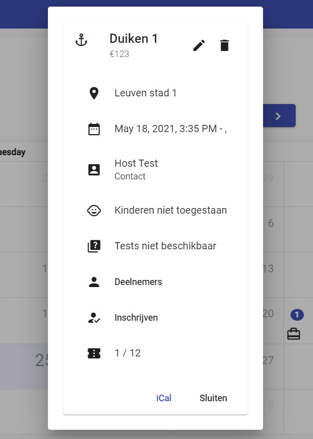

# Logboek
[terug](https://martijnmeeldijk.github.io/stage/)


## Week 11

### 17/05/2021

We hebben zonet onze demo met de mentors gehad.

Dit zijn de dingen die we nog zouden moeten aanpassen

- Refresh pagina bij het ophalen van events (de events worden niet direct ingeladen)
- Color theme aanpassen (blauwe tinten)
- Inschrijving detail niet gerefreshed bij het inschrijven
- Taal rechts bovenaan plaatsen
- Uitloggen 
- Loading screen voorzien op calendar
- Extra Feature: Reserve inschrijvingen als het vol zit
- Datum overal consistent formaat: dd/MM/yyyy hh:mm

Goed, nu weet ik hoe ik verder kan.

Ik begin direct met het eerste item op de lijst. We zitten namelijk al super lang met deze bug. (als je in de vorige logs kijkt zal je hem ongetwijfeld meerdere keren tegenkomen). Deze keer ga ik anders te werk. Ik vraag aan Steven om de API aan te passen, zodat wanneer je een evenement opvraagt, het evenementtype met dat event wordt meegestuurd. Zo moet ik niet voor elk evenement opnieuw een request sturen voor het type (en dus ook het icoontje).


```typescript
  getAllEvents() : Observable<CalendarEvent[]> {
  this.baseUrl =  '${localStorage.getItem("apiurl")}/api/events'
  return this.http.get<IEvent[]>(this.baseUrl, { responseType: 'json' }).pipe(
      map(events =>  events.map( event => ({
            id: event.id.toString(),
            title: event.title,
            start: new Date(event.startDate),
            end: new Date(event.endDate),
            cssClass: event.eventType.icon
            )
      	)
    )
  }
```

HET WERKT!!!

Ik kan nu dus gewoon het icoontje uit het meegegeven evenementtype halen, en dan het event mappen naar een object dat past op onze kalender.

### 18/05/2021

Ik heb er ook voor gezorgd dat in het members gedeelte, de members nu ook direct worden ingeladen. Ik heb het een beetje anders gedaan dan dat hierboven, maar kom. Het werkt. 

Ik ga nu verder met de loading screens. Het is de bedoeling dat elke keer dat een gebruiker ergens op klikt, er direct iets gebeurt. Zo krijgt de gebruiker niet het gevoel dat de app is vastgelopen of niet correct werkt. Als de gebruiker ergens op klikt, en het is niet meteen geladen, moet er een animatie komen die aangeeft dat er iets ingeladen wordt.

Hiervoor heb ik al iets klaarliggen. Angular material heeft namelijk een ingebouwde `mat-spinner`.


Nu hebben we wel één klein probleempje. Ik zou graag ook een laad-icon willen tonen wanneer de site zelf aan het laden is (dus wanneer je op onze site terechtkomt). Het probleem is dat dan alle onderdelen van Material nog niet zijn ingeladen. 

[Hier](https://gist.github.com/DanRibbens/00dc9e971b0df9f58c3726885a2a59aa#file-index-html) heeft iemand op github een leuke oplossing bedacht voor mijn probleem.

Voordat de app geladen wordt, wordt een een klein html bestand gestuurd met enkel het laadicoontje. Zo weet de gebruiker dat de site niet kapot is als het lang duurt om te laden.

Cool. 


### 19/05/2021

Vandaag fix ik nog wat bugs. Zo werd bijvoorbeeld het aantal inschrijvingen op een event niet meteen geüpdatet wanneer iemand zich inschreef voor een evenement:

 

(het getal naast het ticket-icoontje)


Ik ben ook heel de site afgegaan om te controleren of de kleuren overal kloppen. Na een tijd zoeken kwam ik nog een aantal roosgekleurde checkboxes tegen.


Ik heb ook nog verder gewerkt aan het members gedeelte. Het profiel toont nu alle nodige gegevens. Je kan nu ook je profiel bewerken.


### 20/05/2021

Vandaag is het de laatste werkdag van mijn medestudent, Steven. Ik zal je missen :cry:

We houden ons de rest van de dag bezig met alles op te kuisen. Pull requests maken voor branches die we nog niet gemerged hebben. Nutteloze branches verwijderen. Merge conflicts oplossen...