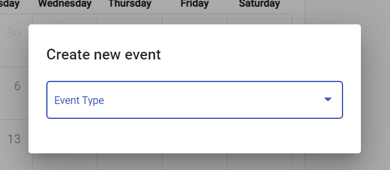
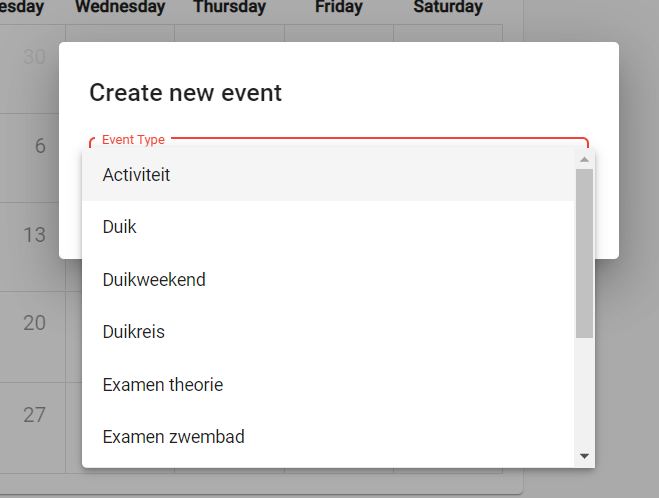
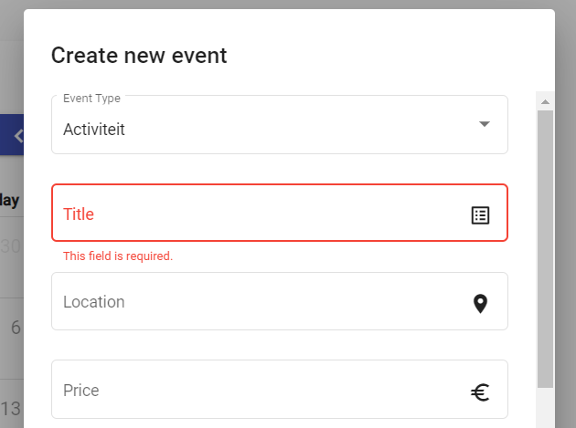
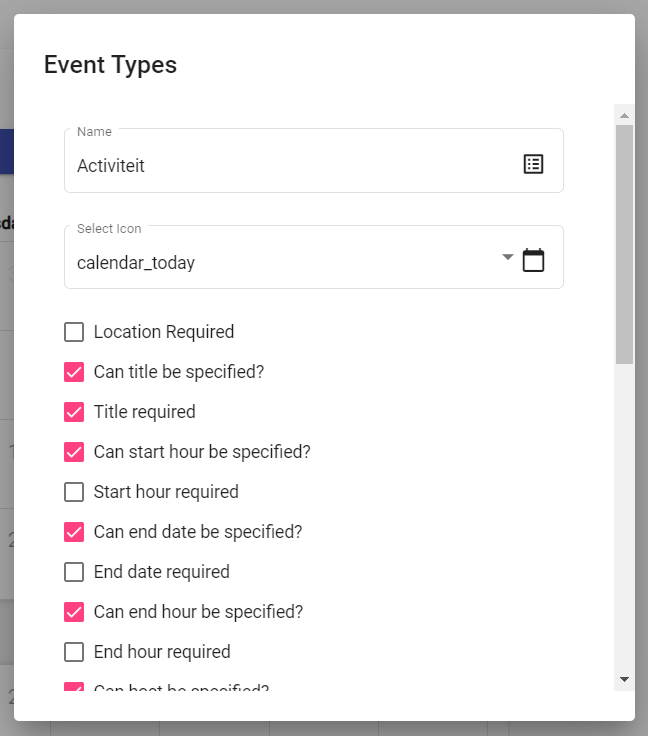
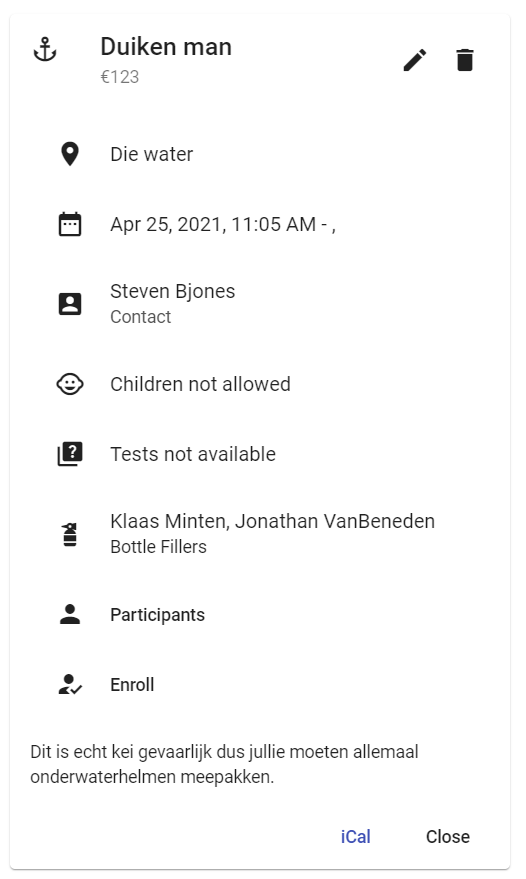

# Logboek
[terug](https://martijnmeeldijk.github.io/stage/)


## Week 5

### 06/04/2021

Ik ga verder met het designen van de applicatie. Het zichtbare gedeelte is zo goed als af. Nu moet ik er voor zorgen dat alle formulieren (evenement toevoegen, inschrijven, ... enzovoort). Juist gevalideerd worden en aangeven wanneer een gebruiker een veld is vergeten of verkeerd heeft ingevuld.

Eigenlijk is dat niet zo gemakkelijk in deze applicatie. Er zijn namelijk een hele boel restricties. Er wordt in het evenementtype bepaald welke velden er verplicht of nodig zijn in een evenement. Ik moet dus een manier vinden om het formulier op maat te maken voor een gekozen evenementtype en daarenboven op de juiste manier valideren.


Ik had een leuk idee. Als je op `New Event` klikt, moet je eerst het evenementtype selecteren.

 



Dan wordt het formulier gegenereerd op basis van de *constraints* die opgelegd worden door het evenementtype.



In het evenementtype `activiteit` is het veld `titel` verplicht. Dat wordt dus ook getoond wanneer de gebruiker het veld vergeet in te vullen. Er zijn bij dit soort evenement bijvoorbeeld ook geen flessenvullers nodig, dus deze velden worden niet getoond.


**Dynamische formvalidatie**

De validatie wordt dynamisch ingesteld door dit stukje code:

```typescript
setValidatorForField(controlName: string, validator: boolean){
    validator? this.eventForm.controls[controlName].setValidators([Validators.required]) : this.eventForm.controls[controlName].clearValidators()
    this.eventForm.get(controlName).updateValueAndValidity()
  }
// Neemt als input het veld en de constraint en zet zo het veld op verplicht of niet.
```

dan kan je per *constraint* de functie zo oproepen:

```typescript
this.setValidatorForField('title', this.selectedEventType.isTitleRequired);
```

Dat spaart weer een hele boel code uit.


**Dynamisch form velden genereren**

```html
<mat-form-field appearance="outline" *ngIf="selectedEventType.isBottleFiller2Required">
            <mat-label>Bottle filler 2</mat-label>
            <mat-select [(value)]="event.bottleFiller2Id" name="bottleFiller2Id" formControlName="bottleFiller2Id">
                <mat-option *ngFor="let member of members" [value]="member.id">{{member.firstName}} {{member.lastName}}
                </mat-option>
            </mat-select>
            <mat-icon matSuffix>fire_extinguisher</mat-icon>
            <mat-error *ngIf="eventForm.get('bottleFiller2Id').hasError('required') && eventForm.get('bottleFiller2Id').touched">
                This field is required.</mat-error>
        </mat-form-field>
```

Eigenlijk staan alle velden in de code, maar worden enkel diegene die nodig zijn getoond. (dankzij `*ngIf="selectedEventType.isBottleFiller2Required"` op de eerste lijn)


### 07/04/2021

De code van gisteren had nog een aantal problemen, dus ik werk nu verder om deze op te lossen. Ik doe hetzelfde als gisteren op het formulier van de `Event Types`. Het ziet er nu best wel mooi uit.



Verder heb ik er ook voor gezorgd dat alle functies (edit, delete, inschrijven, ...) niet meer als knopjes naast het evenement op de kalender staan. Ze krijgen een nieuw thuis binnen de `Event Detail` pagina.



Je kan nu dus bijvoorbeeld klikken op `Enroll` om je in te schrijven voor dit evenement. Of onder de organisator op `Contact` klikken om contact op te nemen met de organisator. Rechts boven staan ook twee knopjes om het evenement te bewerken of te verwijderen. 


### 08/04/2021

Oké vandaag kan ik weer aan iets nieuws beginnen. Op dit moment gebruikt de applicatie Engels en Nederlands door elkaar. Dat is niet zo goed. De gebruiker moet kunnen kiezen welke taal hij wilt. 

In angular kan je de `TranslateModule` van `ngx-translate` gebruiken. 

```typescript
{{ 'KEY' | translate }}
```

Je moet dan elk tekstveld vervangen met een `KEY` die je dan door een translate pipe gooit. 

Met een klein scriptje haal je dan alle `KEY`'s uit de *html*-bestanden en steek je ze in een json:

```bash
ngx-translate-extract --input ./apps/angular-calendar/src ./libs/feature/lazy/calendar/src --output ./apps/angular-calendar/src/assets/i18n/nl.json --clean --format json
```

```json
{
    // ...
	"CALENDAR.WELCOME-HOME": "",
	"CALENDAR.CALENDAR": "",
	"CALENDAR.EVENT-TYPE": "",
	"CALENDAR.TITLE": "",
	"CALENDAR.THIS-FIELD-IS-REQUIRED": "",
	"CALENDAR.LOCATION": "",
	"CALENDAR.PRICE": "",
	"CALENDAR.START-DATE": "",
	"CALENDAR.END-DATE": "",
	"CALENDAR.HOST": "",
    // ...
	}
```

Nu vul je in dit bestand de waarden in die je wilt tonen op de website in de gekozen taal.

Nederlands:

```json
{
	// ...
	"CALENDAR.WELCOME-HOME": "Welkom thuis",
	"CALENDAR.CALENDAR": "Kalender",
	"CALENDAR.EVENT-TYPE": "Evenementtype",
	"CALENDAR.TITLE": "Titel",
	"CALENDAR.THIS-FIELD-IS-REQUIRED": "Dit veld is verplicht.",
	"CALENDAR.LOCATION": "Locatie",
	"CALENDAR.PRICE": "Prijs",
	"CALENDAR.START-DATE": "Startdatum",
	"CALENDAR.END-DATE": "Einddatum",
	"CALENDAR.HOST": "Organisator",
	// ...
}
```

Engels:

```json
{
    // ...
	"CALENDAR.WELCOME-HOME": "Welcome Home",
	"CALENDAR.CALENDAR": "Calendar",
	"CALENDAR.EVENT-TYPE": "Event Type",
	"CALENDAR.TITLE": "Title",
	"CALENDAR.THIS-FIELD-IS-REQUIRED": "This field is required.",
	"CALENDAR.LOCATION": "Location",
	"CALENDAR.PRICE": "Price",
	"CALENDAR.START-DATE": "Start Date",
	"CALENDAR.END-DATE": "End Date",
	"CALENDAR.HOST": "Host",
    // ...
}
```

Je kan dus gemakkelijk nieuwe talen toevoegen door het scriptje opnieuw te laten draaien. Als je bijvoorbeeld nieuwe inhoud op de applicatie toevoegt, moet je ook niet handmatig veldjes toevoegen voor de vertalingen. Je laat gewoon het scriptje nog eens draaien.


### 09/04/2021

Alle velden worden nu dus mooi vertaald, behalve de kalender zelf, omdat deze uit een externe library komt. Nu moet ik dus even kijken hoe ik dat kan oplossen.